<div align="center">



<br/>
<br/>
<br/>
<br/>


<a href="https://github.com/">
  
</a>

<br/><br/>

<p>
  
  
  
  
  
</p>

<p>
  
  
  
  
  
  
  
  
  
</p>

<br/>

### 🔮 Stop finding out about scope creep in the retro. Find out the moment it happens.

<br/>

**[Features](#-features)** • **[Architecture](#-architecture)** • **[Quick Start](#-quick-start)** • **[Screens](#-screens-tour)** • **[API](#-api-overview)** • **[Tech Stack](#-tech-stack)** • **[Roadmap](#-roadmap)**

</div>

<br/>

## 📌 What is ScopeSentinel?

**ScopeSentinel** watches the gap between what was *promised* (requirements from meetings, emails, tickets) and what was *shipped* (actual code in your GitHub repo) — and closes it automatically.

A pipeline of **8 autonomous AI agents**, orchestrated with **LangGraph**, reads unstructured requirement text, detects when it changes, traces the blast radius through a dependency graph, scores the risk, checks whether your codebase actually implements it, reviews pull requests for compliance, and notifies the right channel — all without a human babysitting the process.

> Built as an end-to-end, production-shaped reference project: real auth, real diffing, real graph traversal, real vector search — not a toy CRUD demo.

<br/>

## ✨ Features

<table>
<tr>
<td width="50%" valign="top">

### 🧠 AI Agent Pipeline
- **Agent 1 — Extractor**: pulls structured requirements out of raw meeting/email text
- **Agent 2 — Change Detector**: flags additions, removals, and word-level diffs
- **Agent 3 — GitHub Intel**: classifies files and reads commit history
- **Agent 4 — Coverage Scorer**: measures how much of a requirement is actually implemented
- **Agent 5 — Impact Analyzer**: BFS traversal across a Neo4j dependency graph
- **Agent 6 — Risk Scorer**: quantifies the blast radius of a change
- **Agent 7 — PR Reviewer**: scores pull requests against linked requirements
- **Agent 8 — Notifier**: routes alerts to dashboard / email / Slack

</td>
<td width="50%" valign="top">

### 🖥️ Product Surface
- 13-page React dashboard with a dark "mission control" theme
- Live agent pipeline trigger from the Upload Center
- Word-level diff viewer for every detected change
- Interactive impact graph explorer
- GitHub repo scanning + per-requirement coverage breakdown
- PR compliance scoring with GitHub-comment preview
- Exportable / printable project reports
- JWT-secured multi-user auth

</td>
</tr>
</table>

<br/>

## 🏗️ Architecture

```
## 🏗️ Architecture

```text
                           ┌──────────────────────────────┐
                           │      React Frontend          │
                           │------------------------------│
                           │ • Dashboard (13 Pages)       │
                           │ • Tailwind CSS               │
                           │ • React Router               │
                           │ • Axios API Client           │
                           └──────────────┬───────────────┘
                                          │
                                   REST API / JWT
                                          │
                          ┌───────────────▼────────────────┐
                          │        FastAPI Backend         │
                          │--------------------------------│
                          │ Authentication                 │
                          │ Requirement Management         │
                          │ GitHub Integration             │
                          │ AI Agent Orchestration         │
                          │ Analytics & Reporting          │
                          └───────────────┬────────────────┘
                                          │
        ┌─────────────────────────────────┼─────────────────────────────────┐
        │                                 │                                 │
        ▼                                 ▼                                 ▼
┌────────────────┐              ┌─────────────────┐               ┌─────────────────┐
│ PostgreSQL     │              │    LangGraph    │               │     Redis       │
│----------------│              │-----------------│               │-----------------│
│ Users          │              │ 8 AI Agents     │               │ Queue / Cache   │
│ Projects       │              │ Workflow Engine │               │ Session Cache   │
│ Requirements   │              │ GPT-4o-mini     │               │ Performance     │
└──────┬─────────┘              └────────┬────────┘               └─────────────────┘
       │                                 │
       │                                 │
       ▼                                 ▼
┌────────────────┐              ┌─────────────────┐
│ Neo4j          │              │     Qdrant      │
│----------------│              │-----------------│
│ Dependency     │              │ Vector Search   │
│ Graph          │              │ Embeddings      │
│ BFS Traversal  │              │ Similarity      │
└────────────────┘              └─────────────────┘
       │
       ▼
┌────────────────┐
│ MongoDB        │
│----------------│
│ Agent States   │
│ Checkpoints    │
│ Logs           │
└────────────────┘

                    External Integrations

        GitHub API      OpenAI API      Claude MCP
              │              │               │
              └──────────────┼───────────────┘
                             ▼
                     ScopeSentinel Platform
```
```

A separate **MCP server** exposes ScopeSentinel's data as tools so **Claude Desktop** can query projects, requirements, and risk directly in conversation.

<br/>

## 🧰 Tech Stack

| Layer | Technology |
|---|---|
| **Frontend** | React 18, Vite, Tailwind CSS, Recharts, React Router, Axios, lucide-react |
| **Backend** | FastAPI, SQLAlchemy, Alembic, Pydantic, python-jose (JWT), passlib (bcrypt) |
| **AI / Agents** | LangGraph, LangChain Core, OpenAI (GPT-4o-mini) |
| **Data** | PostgreSQL (core), Neo4j (impact graph), Qdrant (embeddings), MongoDB (agent checkpoints), Redis (cache) |
| **Integrations** | PyGithub (repo scanning, PR review), MCP (Claude Desktop) |
| **DevOps** | Docker Compose, GitHub Actions CI, Railway (backend), Vercel (frontend) |

<br/>

## 🚀 Quick Start

### Prerequisites
Make sure these are installed:

| Tool | Link |
|---|---|
| Docker Desktop | https://www.docker.com/products/docker-desktop/ |
| Python 3.11 | https://www.python.org/downloads/ |
| Node.js 18+ | https://nodejs.org/ |
| VS Code | https://code.visualstudio.com/ |

### 1. Clone & configure

```bash
git clone https://github.com/<your-username>/ScopeSentinel.git
cd ScopeSentinel

cp backend/.env.example backend/.env
```

Open `backend/.env` and set your real key (required — Agents 1, 4, 6, 7 call GPT-4o-mini):

```env
OPENAI_API_KEY=sk-your-real-key-here
```

> ⚠️ `backend/.env` is git-ignored on purpose. Never commit real API keys — use `.env.example` as the template for anyone cloning this repo.

### 2. Start the data layer

Make sure Docker Desktop is running, then:

```bash
./reset_docker.bat        # Windows
```

Confirm Postgres is reachable — you should see:
```
 ?column?
----------
        1
(1 row)
```

### 3. Backend

```bash
cd backend
python -m venv venv
venv\Scripts\activate        # macOS/Linux: source venv/bin/activate
pip install -r requirements.txt

alembic upgrade head
cd ..
python scripts/seed.py
python scripts/setup_neo4j.py
python scripts/embed_requirements.py

cd backend
uvicorn app.main:app --reload --host 0.0.0.0 --port 8000
```

Visit **http://localhost:8000/docs** to confirm all 33 endpoints are live.

### 4. Frontend

```bash
cd frontend
npm install
npm run dev
```

Visit **http://localhost:5173** and log in:

```
Email:    pm@scopesentinel.com
Password: password123
```

### 5. (Optional) MCP server for Claude Desktop

```bash
cd mcp-server
python -m venv venv
venv\Scripts\activate
pip install -r requirements.txt
cp .env.example .env
```

Add to `claude_desktop_config.json`:

```json
{
  "mcpServers": {
    "scopesentinel": {
      "command": "C:\\path\\to\\ScopeSentinel\\mcp-server\\venv\\Scripts\\python.exe",
      "args": ["C:\\path\\to\\ScopeSentinel\\mcp-server\\server.py"]
    }
  }
}
```

Restart Claude Desktop, then try: *"List my ScopeSentinel projects."*

<br/>

## 📺 Screens Tour

| Page | Purpose |
|---|---|
| **Dashboard** | KPIs, risk donut chart, coverage breakdown, recent changes |
| **Upload Center** | Paste meeting/email text, run the full 5-agent pipeline live |
| **Change Center** | Word-level diff viewer with risk badges |
| **Impact Graph** | BFS-affected modules by depth, per requirement |
| **Risk Center** | Risk distribution + filterable change list |
| **GitHub Center** | Scan a repo, view file classification & recent commits |
| **Coverage Center** | Per-requirement coverage %, found/missing details |
| **PR Review Center** | Run the PR reviewer agent, preview the GitHub comment |
| **Notifications** | Alert history across dashboard/email/Slack |
| **Team Management** | Register users, view seeded accounts |
| **Reports** | Printable/exportable project summary |
| **Settings** | Configure the linked GitHub repo |

<br/>

## 🔌 API Overview

33 REST endpoints across these groups — full interactive docs at `/docs` once the backend is running:

```
/auth/*            Registration, login, JWT issuance
/projects/*         Project CRUD + config
/requirements/*      Requirement CRUD + search
/changes/*           Detected change history + diffs
/agent/run           Trigger the full agent pipeline
/impact/analyze       BFS impact traversal
/github/*            Repo scan, coverage, file classification
/pr-review/run        PR compliance scoring
/analytics/*          Dashboard aggregates
```

<br/>

## 🗺️ Roadmap

- [ ] Slack app (native OAuth install, not just webhook)
- [ ] Multi-repo project support
- [ ] Fine-tuned risk-scoring model (replace heuristic + LLM hybrid)
- [ ] GitLab / Bitbucket adapters alongside GitHub
- [ ] Self-serve onboarding flow (no manual seed script)

<br/>

## 🤝 Contributing

Contributions are welcome. Please open an issue to discuss what you'd like to change before submitting a large PR.

```bash
git checkout -b feature/your-feature
git commit -m "Add: your feature"
git push origin feature/your-feature
```

Then open a Pull Request.

<br/>

## 📄 License

Distributed under the **MIT License**. See [`LICENSE`](./LICENSE) for details.

<br/>

<br>

---

<div align="center">



<br/>

Built with FastAPI, React, LangGraph, and a healthy distrust of scope creep.

<br/>

Made by [Kalagi Pandya](https://github.com/KalagiPandya) · ⭐ Star this repo if it saved you a scope-creep headache

</div>
</div>

