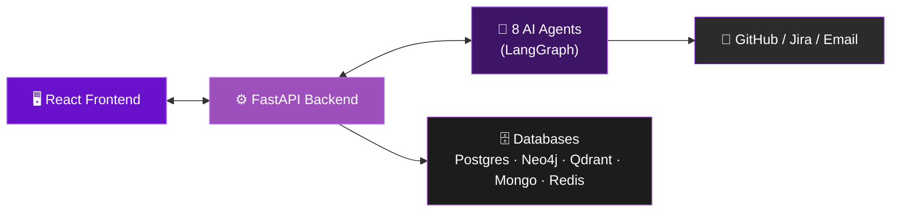

<div align="center">

  

  <br><br>

  

  <br><br>

</div>
<p>
  
  
  
  
  
</p>

<p>
  
  
  
  
  
  
  
  
  
</p>

### 🔮 Stop finding out about scope creep in the retro. Find out the moment it happens.

[Features](#-features) • [Architecture](#-architecture) • [Agent Pipeline](#-the-8-agent-pipeline) • [Quick Start](#-quick-start) • [Screens](#-screens-tour) • [API](#-api-overview) • [Tech Stack](#-tech-stack) • [Roadmap](#-roadmap)

</div>

<br/>

## 📌 What is ScopeSentinel?

**ScopeSentinel** watches the gap between what was *promised* (requirements from meetings, emails, tickets) and what was *shipped* (actual code in your GitHub repo) — and closes it automatically.

A pipeline of **8 autonomous AI agents**, orchestrated with **LangGraph**, reads unstructured requirement text, detects when it changes, traces the blast radius through a dependency graph, scores the risk, checks whether your codebase actually implements it, reviews pull requests for compliance, and notifies the right channel — all without a human babysitting the process.


<br/>

## ✨ Features

<table>
<tr>
<td width="50%" valign="top">

### 🧠 AI Agent Pipeline
- **Agent 1 — Extractor**: pulls structured requirements out of raw meeting/email text
- **Agent 2 — Change Detector**: flags additions, removals, and word-level diffs
- **Agent 3 — GitHub Intel**: classifies files and reads commit history
- **Agent 4 — Coverage Scorer**: measures how much of a requirement is actually implemented
- **Agent 5 — Impact Analyzer**: BFS traversal across a Neo4j dependency graph
- **Agent 6 — Risk Scorer**: quantifies the blast radius of a change
- **Agent 7 — PR Reviewer**: scores pull requests against linked requirements
- **Agent 8 — Notifier**: routes alerts to dashboard / email / Slack

</td>
<td width="50%" valign="top">

### 🖥️ Product Surface
- 13-page React dashboard with a dark "mission control" theme
- Live agent pipeline trigger from the Upload Center
- Word-level diff viewer for every detected change
- Interactive impact graph explorer
- GitHub repo scanning + per-requirement coverage breakdown
- PR compliance scoring with GitHub-comment preview
- Exportable / printable project reports
- JWT-secured multi-user auth

</td>
</tr>
</table>

<br/>

## 🏗️ Architecture

<div align="center">


```mermaid
flowchart LR
    A["🖥️ React Frontend"] <--> B["⚙️ FastAPI Backend"]
    B <--> C["🤖 8 AI Agents\n(LangGraph)"]
    B --> D["🗄️ Databases\nPostgres · Neo4j · Qdrant · Mongo · Redis"]
    C --> E["🔗 GitHub / Jira / Email"]

    style A fill:#6A11CB,stroke:#B266FF,color:#fff
    style B fill:#9D50BB,stroke:#B266FF,color:#fff
    style C fill:#3d1466,stroke:#B266FF,color:#fff
    style D fill:#1c1c1c,stroke:#9D50BB,color:#fff
    style E fill:#2b2b2b,stroke:#6A11CB,color:#fff
```

**Frontend** talks to the **Backend**, which triggers the **AI Agents**, which read/write **Databases** and reach out to **GitHub, Jira & Email**. That's it. 🍥

</div>

A separate, lightweight **MCP server** also exposes this same data as tools so **Claude Desktop** can query projects, requirements, and risk directly in conversation.

<br/>

## 🔄 The 8-Agent Pipeline

<div align="center">

🧩 **Extractor** → 🔍 **Change Detector** → 🐙 **GitHub Intel** → 📊 **Coverage Scorer** → 🕸️ **Impact Analyzer** → 🚦 **Risk Scorer** → ✅ **PR Reviewer** → 🔔 **Notifier**

| # | Agent | What it does |
|:-:|---|---|
| 1️⃣ | Extractor | Turns raw meeting/email/Jira text into structured requirements |
| 2️⃣ | Change Detector | Flags additions, removals, word-level diffs |
| 3️⃣ | GitHub Intel | Classifies files, reads commit history |
| 4️⃣ | Coverage Scorer | Measures how much of a requirement is actually implemented |
| 5️⃣ | Impact Analyzer | BFS traversal across the Neo4j dependency graph |
| 6️⃣ | Risk Scorer | Quantifies the blast radius of a change |
| 7️⃣ | PR Reviewer | Scores pull requests against linked requirements |
| 8️⃣ | Notifier | Routes alerts to dashboard / email / Slack |

</div>

<br/>

## 🧰 Tech Stack

| Layer | Technology |
|---|---|
| **Frontend** | React 18, Vite, Tailwind CSS, Recharts, React Router, Axios, lucide-react |
| **Backend** | FastAPI, SQLAlchemy, Alembic, Pydantic, python-jose (JWT), passlib (bcrypt) |
| **AI / Agents** | LangGraph, LangChain Core, OpenAI (GPT-4o-mini) |
| **Data** | PostgreSQL (core), Neo4j (impact graph), Qdrant (embeddings), MongoDB (agent checkpoints), Redis (cache) |
| **Integrations** | PyGithub (repo scanning, PR review), MCP (Claude Desktop) |
| **DevOps** | Docker Compose, GitHub Actions CI, Railway (backend), Vercel (frontend) |

<br/>

## 🚀 Quick Start

### Prerequisites

| Tool | Link |
|---|---|
| Docker Desktop | https://www.docker.com/products/docker-desktop/ |
| Python 3.11 | https://www.python.org/downloads/ |
| Node.js 18+ | https://nodejs.org/ |
| VS Code | https://code.visualstudio.com/ |

<details>
<summary><b>1. Clone & configure</b></summary>

```bash
git clone https://github.com/<your-username>/ScopeSentinel.git
cd ScopeSentinel

cp backend/.env.example backend/.env
```

Open `backend/.env` and set your real key (required — Agents 1, 4, 6, 7 call GPT-4o-mini):

```env
OPENAI_API_KEY=sk-your-real-key-here
```

> ⚠️ `backend/.env` is git-ignored on purpose. Never commit real API keys — use `.env.example` as the template for anyone cloning this repo.

</details>

<details>
<summary><b>2. Start the data layer</b></summary>

Make sure Docker Desktop is running, then:

```bash
./reset_docker.bat        # Windows
```

Confirm Postgres is reachable — you should see:
```
 ?column?
----------
        1
(1 row)
```

</details>

<details>
<summary><b>3. Backend</b></summary>

```bash
cd backend
python -m venv venv
venv\Scripts\activate        # macOS/Linux: source venv/bin/activate
pip install -r requirements.txt

alembic upgrade head
cd ..
python scripts/seed.py
python scripts/setup_neo4j.py
python scripts/embed_requirements.py

cd backend
uvicorn app.main:app --reload --host 0.0.0.0 --port 8000
```

Visit **http://localhost:8000/docs** to confirm all 33 endpoints are live.

</details>

<details>
<summary><b>4. Frontend</b></summary>

```bash
cd frontend
npm install
npm run dev
```

Visit **http://localhost:5173** and log in:

```
Email:    pm@scopesentinel.com
Password: password123
```

</details>

<details>
<summary><b>5. (Optional) MCP server for Claude Desktop</b></summary>

```bash
cd mcp-server
python -m venv venv
venv\Scripts\activate
pip install -r requirements.txt
cp .env.example .env
```

Add to `claude_desktop_config.json`:

```json
{
  "mcpServers": {
    "scopesentinel": {
      "command": "C:\\path\\to\\ScopeSentinel\\mcp-server\\venv\\Scripts\\python.exe",
      "args": ["C:\\path\\to\\ScopeSentinel\\mcp-server\\server.py"]
    }
  }
}
```

Restart Claude Desktop, then try: *"List my ScopeSentinel projects."*

</details>

<br/>

## 📺 Screens Tour

| Page | Purpose |
|---|---|
| **Dashboard** | KPIs, risk donut chart, coverage breakdown, recent changes |
| **Upload Center** | Paste meeting/email text, run the full 5-agent pipeline live |
| **Change Center** | Word-level diff viewer with risk badges |
| **Impact Graph** | BFS-affected modules by depth, per requirement |
| **Risk Center** | Risk distribution + filterable change list |
| **GitHub Center** | Scan a repo, view file classification & recent commits |
| **Coverage Center** | Per-requirement coverage %, found/missing details |
| **PR Review Center** | Run the PR reviewer agent, preview the GitHub comment |
| **Notifications** | Alert history across dashboard/email/Slack |
| **Team Management** | Register users, view seeded accounts |
| **Reports** | Printable/exportable project summary |
| **Settings** | Configure the linked GitHub repo |

<br/>

## 🔌 API Overview

33 REST endpoints across these groups — full interactive docs at `/docs` once the backend is running:

```
/auth/*               Registration, login, JWT issuance
/projects/*            Project CRUD + config
/requirements/*         Requirement CRUD + search
/changes/*              Detected change history + diffs
/agent/run              Trigger the full agent pipeline on pasted text
/jira/sync              Pull real Jira issues and run them through the pipeline
/email/sync             Pull unread inbox emails and run them through the pipeline
/impact/analyze          BFS impact traversal
/github/*                Repo scan, coverage, file classification
/pr-review/run           PR compliance scoring
/analytics/*              Dashboard aggregates
```

<br/>

## 🧠 LLM Provider — OpenAI or local Ollama

Agents 1, 4, 6, and 7 need an LLM. By default the app uses OpenAI's GPT-4o-mini, which costs money and is rate-limited. If you'd rather run fully offline with no cost and no rate limits, switch to a local [Ollama](https://ollama.com) model instead:

```bash
# 1. Install Ollama, then pull a model
ollama pull llama3.1

# 2. Start the Ollama server
ollama serve

# 3. In backend/.env, switch the provider
LLM_PROVIDER=ollama
OLLAMA_BASE_URL=http://localhost:11434
OLLAMA_MODEL=llama3.1
```

No code changes needed — every agent routes through `app/services/llm_service.py`, which picks the provider based on `LLM_PROVIDER`. Ollama responses are generally lower quality than GPT-4o-mini, so expect slightly noisier extraction/scoring — fine for a demo or development, but keep OpenAI for a polished placement demo if you can afford the small usage cost.

<br/>

## 🔗 Real Jira and Email ingestion

Earlier versions of this README described ScopeSentinel as "watching meetings, emails, and Jira" — but only manual paste (`/agent/run`) was actually wired up. That's now backed by real integrations:

**Jira** — `POST /jira/sync` pulls issues from a real Jira Cloud project (summary + description + recent comments) and runs each one through the same Agent 1 + Agent 2 pipeline as a manual paste.
```env
JIRA_BASE_URL=https://yourteam.atlassian.net
JIRA_EMAIL=you@example.com
JIRA_API_TOKEN=your-jira-api-token   # https://id.atlassian.com/manage-profile/security/api-tokens
JIRA_PROJECT_KEY=SCOPE
```
Check credentials with `GET /jira/test-connection` first.

**Email** — `POST /email/sync` reads unread messages from a real IMAP inbox (subject + body) and runs each one through the pipeline the same way.
```env
IMAP_HOST=imap.gmail.com
IMAP_USER=you@example.com
IMAP_PASSWORD=your-app-password   # Gmail: https://myaccount.google.com/apppasswords
```
Check credentials with `GET /email/test-connection` first.

Both are optional — the app works fine without them, exactly like GitHub scanning is optional. Neither has a frontend button yet (still paste-only in the UI); trigger them via `/docs` or `curl` for now.

<br/>

## 🗺️ Roadmap

- [ ] Slack app (native OAuth install, not just webhook)
- [ ] Multi-repo project support
- [ ] Fine-tuned risk-scoring model (replace heuristic + LLM hybrid)
- [ ] GitLab / Bitbucket adapters alongside GitHub
- [ ] Self-serve onboarding flow (no manual seed script)

<br/>

## 🤝 Contributing

Contributions are welcome. Please open an issue to discuss what you'd like to change before submitting a large PR.

```bash
git checkout -b feature/your-feature
git commit -m "Add: your feature"
git push origin feature/your-feature
```

Then open a Pull Request.

<br/>

## 📄 License

Distributed under the **MIT License**. See [`LICENSE`](./LICENSE) for details.

<br/>

<div align="center">


</div>
