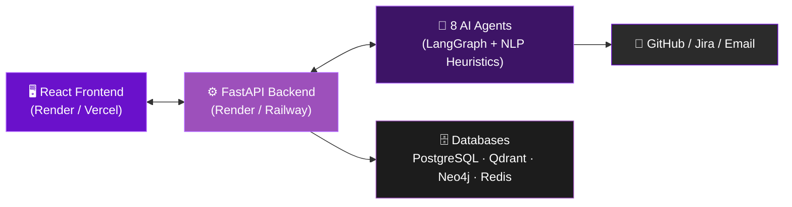

<div align="center">

  


  

  <br>

</div>
<p align="center">
  
  
  
  
  
</p>

<p align="center"> 
  
  
  
  
  
  
  
  
  
</p>

<div align="center">
### 🔮 Stop finding out about scope creep in the retro. Find out the moment it happens.

[🌐 Live Web App](https://scopesentinel-frontend.onrender.com) • [📖 Live API Docs](https://scopesentinel-backend.onrender.com/docs) • [Features](#-features) • [Architecture](#-architecture) • [Agent Pipeline](#-the-8-agent-pipeline) • [Deployment](#-cloud-deployment) • [Quick Start](#-quick-start) • [Tech Stack](#-tech-stack)

</div>
<br>

---

## 🌐 Live Cloud Deployment

| Service | Status | Link |
|---|---|---|
| **Frontend Web App** | 🟢 Live | [scopesentinel-frontend.onrender.com](https://scopesentinel-frontend.onrender.com) |
| **Backend Swagger API** | 🟢 Live | [scopesentinel-backend.onrender.com/docs](https://scopesentinel-backend.onrender.com/docs) |
| **Demo Login** | 🔑 Active | `pm@scopesentinel.com` / `password123` |

<br/>

## 🔮 Real-time AI Requirement Intelligence

**Stop finding out about scope creep during the retrospective.  
Detect requirement changes the moment they happen, analyze their impact, verify implementation coverage, and review pull requests automatically using an 8-Agent AI pipeline.**

<br/>

## 📌 What is ScopeSentinel?

**ScopeSentinel** watches the gap between what was *promised* (requirements from meetings, emails, tickets) and what was *shipped* (actual code in your GitHub repo) — and closes it automatically.

A pipeline of **8 autonomous AI agents**, orchestrated with **LangGraph**, reads unstructured requirement text, detects when it changes, traces the blast radius through a dependency graph, scores the risk, checks whether your codebase actually implements it, reviews pull requests for compliance, and notifies the right channel — with 100% cloud resilience and zero-key local fallback.

<br/>

## ✨ Features

<table>
<tr>
<td width="50%" valign="top">

### 🧠 AI Agent Pipeline
- **Agent 1 — Extractor**: pulls structured requirements out of raw meeting/email text
- **Agent 2 — Change Detector**: flags additions, removals, and word-level diffs
- **Agent 3 — GitHub Intel**: classifies files and reads commit history
- **Agent 4 — Coverage Scorer**: measures how much of a requirement is actually implemented
- **Agent 5 — Impact Analyzer**: BFS traversal across a Neo4j dependency graph
- **Agent 6 — Risk Scorer**: quantifies the blast radius of a change
- **Agent 7 — PR Reviewer**: scores pull requests against linked requirements
- **Agent 8 — Notifier**: routes alerts to dashboard / email / Slack

</td>
<td width="50%" valign="top">

### 🖥️ Product Surface
- 13-page React dashboard with a dark "mission control" theme
- Live agent pipeline trigger from the Upload Center
- Word-level diff viewer for every detected change
- Interactive impact graph explorer
- GitHub repo scanning + per-requirement coverage breakdown
- PR compliance scoring with GitHub-comment preview
- Exportable / printable project reports
- JWT-secured multi-user auth with native bcrypt

</td>
</tr>
</table>

<br/>

## 🏗️ Architecture

<div align="center">


```mermaid
flowchart LR
    A["🖥️ React Frontend\n(Render / Vercel)"] <--> B["⚙️ FastAPI Backend\n(Render / Railway)"]
    B <--> C["🤖 8 AI Agents\n(LangGraph + NLP Heuristics)"]
    B --> D["🗄️ Databases\nPostgreSQL · Qdrant · Neo4j · Redis"]
    C --> E["🔗 GitHub / Jira / Email"]

    style A fill:#6A11CB,stroke:#B266FF,color:#fff
    style B fill:#9D50BB,stroke:#B266FF,color:#fff
    style C fill:#3d1466,stroke:#B266FF,color:#fff
    style D fill:#1c1c1c,stroke:#9D50BB,color:#fff
    style E fill:#2b2b2b,stroke:#6A11CB,color:#fff
```

**Frontend** talks to the **Backend**, which triggers the **AI Agents**, which read/write **Databases** and reach out to **GitHub, Jira & Email**. 🍥

</div>

A separate, lightweight **MCP server** also exposes this same data as tools so **Claude Desktop** can query projects, requirements, and risk directly in conversation.

<br/>

## 🔄 The 8-Agent Pipeline

<div align="center">

🧩 **Extractor** → 🔍 **Change Detector** → 🐙 **GitHub Intel** → 📊 **Coverage Scorer** → 🕸️ **Impact Analyzer** → 🚦 **Risk Scorer** → ✅ **PR Reviewer** → 🔔 **Notifier**

| # | Agent | What it does |
|:-:|---|---|
| 1️⃣ | Extractor | Turns raw meeting/email/Jira text into structured requirements |
| 2️⃣ | Change Detector | Flags additions, removals, word-level diffs |
| 3️⃣ | GitHub Intel | Classifies files, reads commit history |
| 4️⃣ | Coverage Scorer | Measures how much of a requirement is actually implemented |
| 5️⃣ | Impact Analyzer | BFS traversal across the Neo4j dependency graph |
| 6️⃣ | Risk Scorer | Quantifies the blast radius of a change |
| 7️⃣ | PR Reviewer | Scores pull requests against linked requirements |
| 8️⃣ | Notifier | Routes alerts to dashboard / email / Slack |

</div>

<br/>

## ☁️ 1-Click Cloud Deployment (Render Blueprint)

ScopeSentinel comes with a pre-configured [`render.yaml`](./render.yaml) Blueprint that automatically provisions the **PostgreSQL Database**, **FastAPI Backend**, and **React Frontend** in a single click:

1. Fork or push this repository to your GitHub account.
2. Go to **[Render Dashboard](https://dashboard.render.com)** → Click **New +** → **Blueprint**.
3. Select your repository `ScopeSentinel`.
4. Click **Apply**. Render will automatically provision all three services!

<br/>

## 🧰 Tech Stack

| Layer | Technology |
|---|---|
| **Frontend** | React 18, Vite, Tailwind CSS, Recharts, React Router, Axios, Lucide Icons |
| **Backend** | FastAPI, SQLAlchemy, Alembic, Pydantic, python-jose (JWT), bcrypt |
| **AI / Agents** | LangGraph, LangChain Core, OpenAI (GPT-4o-mini), Smart NLP Heuristics |
| **Data** | PostgreSQL (core), Neo4j (impact graph), Qdrant (embeddings), MongoDB (checkpoints), Redis (cache) |
| **Integrations** | PyGithub (repo scanning, PR review), MCP (Claude Desktop) |
| **DevOps** | Render (1-click Blueprint), Docker Compose, GitHub Actions CI, Railway |

<br/>

## 🚀 Local Quick Start

### Prerequisites

| Tool | Link |
|---|---|
| Docker Desktop | https://www.docker.com/products/docker-desktop/ |
| Python 3.11+ | https://www.python.org/downloads/ |
| Node.js 18+ | https://nodejs.org/ |
| VS Code | https://code.visualstudio.com/ |

<details>
<summary><b>1. Clone & configure</b></summary>

```bash
git clone https://github.com/KalagiPandya/ScopeSentinel.git
cd ScopeSentinel

cp backend/.env.example backend/.env
```

Open `backend/.env` to optionally set keys:
```env
OPENAI_API_KEY=sk-your-real-key-here # Optional (Smart NLP fallback operates if unset)
```

</details>

<details>
<summary><b>2. Start Data Layer (Docker)</b></summary>

```bash
docker compose up -d
```

</details>

<details>
<summary><b>3. Backend</b></summary>

```bash
cd backend
python -m venv venv
venv\Scripts\activate        # macOS/Linux: source venv/bin/activate
pip install -r requirements.txt

# Start backend (Auto-seeds demo project & users automatically on startup)
uvicorn app.main:app --reload --host 0.0.0.0 --port 8000
```

Visit **http://localhost:8000/docs** to confirm all 33 endpoints are live.

</details>

<details>
<summary><b>4. Frontend</b></summary>

```bash
cd frontend
npm install
npm run dev
```

Visit **http://localhost:5173** and log in with seeded accounts:

```
Product Manager : pm@scopesentinel.com  / password123
Developer       : dev@scopesentinel.com / password123
QA Engineer     : qa@scopesentinel.com  / password123
```

</details>

<br/>

## 🧠 AI Engine Modes — Cloud, Local & Zero-Key

All agents route through `app/services/llm_service.py` with multi-mode resilience:

1. **Cloud OpenAI**: Uses `OPENAI_API_KEY` (GPT-4o-mini).
2. **Local Ollama**: Set `LLM_PROVIDER=ollama` to run fully offline with zero cost.
3. **Smart NLP Fallback**: Operates automatically without API keys, ensuring 100% uptime for recruiter demos and portfolio showcases.

<br/>

## 📺 Screens Tour

| Page | Purpose |
|---|---|
| **Dashboard** | KPIs, risk score gauge, coverage breakdown, recent change log |
| **Upload Center** | Paste meeting/email text, run the full 5-agent pipeline live |
| **Change Center** | Word-level diff viewer with risk badges |
| **Impact Graph** | BFS-affected modules by depth, per requirement |
| **Risk Center** | Risk distribution + filterable change list |
| **GitHub Center** | Scan a repo, view file classification & recent commits |
| **Coverage Center** | Per-requirement coverage %, found/missing details |
| **PR Review Center** | Run the PR reviewer agent, preview the GitHub comment |
| **Notifications** | Alert history across dashboard/email/Slack |
| **Team Management** | User roles and seeded permissions |
| **Reports** | Printable/exportable sprint summary |
| **Settings** | Configure linked repository and credentials |

<br/>

## 🗺️ Roadmap

- [x] 1-Click Cloud Deployment (Render Blueprint + Vercel)
- [x] Zero-key intelligent NLP heuristic fallback engine
- [x] Auto-seeding database initialization
- [ ] Slack app (native OAuth install)
- [ ] Multi-repo project support
- [ ] GitLab / Bitbucket adapters alongside GitHub

<br/>

## 📄 License

Distributed under the **MIT License**. See [`LICENSE`](./LICENSE) for details.

<br/>

<div align="center">


</div>
