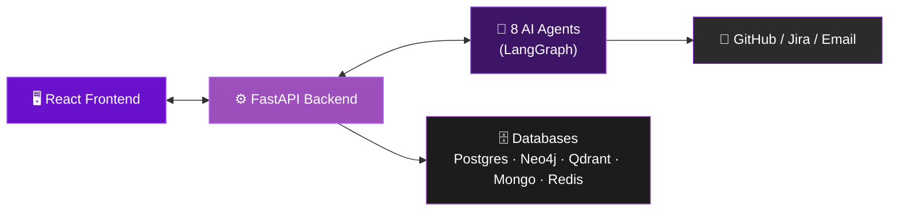

<div align="center">


<br/>

<p>
  
  
  
  
  
</p>

<p>
  
  
  
  
  
  
  
  
  
</p>

### 🔮 Stop finding out about scope creep in the retro. Find out the moment it happens.

[Features](#-features) • [Architecture](#-architecture) • [Agent Pipeline](#-the-8-agent-pipeline) • [Quick Start](#-quick-start) • [Screens](#-screens-tour) • [API](#-api-overview) • [Tech Stack](#-tech-stack) • [Roadmap](#-roadmap)

</div>

<br/>

## 📌 What is ScopeSentinel?

**ScopeSentinel** watches the gap between what was *promised* (requirements from meetings, emails, tickets) and what was *shipped* (actual code in your GitHub repo) — and closes it automatically.

A pipeline of **8 autonomous AI agents**, orchestrated with **LangGraph**, reads unstructured requirement text, detects when it changes, traces the blast radius through a dependency graph, scores the risk, checks whether your codebase actually implements it, reviews pull requests for compliance, and notifies the right channel — all without a human babysitting the process.

> Built as an end-to-end, production-shaped reference project: real auth, real diffing, real graph traversal, real vector search — not a toy CRUD demo.

<br/>

## ✨ Features

<table>
<tr>
<td width="50%" valign="top">

### 🧠 AI Agent Pipeline
- **Agent 1 — Extractor**: pulls structured requirements out of raw meeting/email text
- **Agent 2 — Change Detector**: flags additions, removals, and word-level diffs
- **Agent 3 — GitHub Intel**: classifies files and reads commit history
- **Agent 4 — Coverage Scorer**: measures how much of a requirement is actually implemented
- **Agent 5 — Impact Analyzer**: BFS traversal across a Neo4j dependency graph
- **Agent 6 — Risk Scorer**: quantifies the blast radius of a change
- **Agent 7 — PR Reviewer**: scores pull requests against linked requirements
- **Agent 8 — Notifier**: routes alerts to dashboard / email / Slack

</td>
<td width="50%" valign="top">

### 🖥️ Product Surface
- 13-page React dashboard with a dark "mission control" theme
- Live agent pipeline trigger from the Upload Center
- Word-level diff viewer for every detected change
- Interactive impact graph explorer
- GitHub repo scanning + per-requirement coverage breakdown
- PR compliance scoring with GitHub-comment preview
- Exportable / printable project reports
- JWT-secured multi-user auth

</td>
</tr>
</table>

<br/>

## 🏗️ Architecture

<div align="center">


```mermaid
flowchart LR
    A["🖥️ React Frontend"] <--> B["⚙️ FastAPI Backend"]
    B <--> C["🤖 8 AI Agents\n(LangGraph)"]
    B --> D["🗄️ Databases\nPostgres · Neo4j · Qdrant · Mongo · Redis"]
    C --> E["🔗 GitHub / Jira / Email"]

    style A fill:#6A11CB,stroke:#B266FF,color:#fff
    style B fill:#9D50BB,stroke:#B266FF,color:#fff
    style C fill:#3d1466,stroke:#B266FF,color:#fff
    style D fill:#1c1c1c,stroke:#9D50BB,color:#fff
    style E fill:#2b2b2b,stroke:#6A11CB,color:#fff
```

**Frontend** talks to the **Backend**, which triggers the **AI Agents**, which read/write **Databases** and reach out to **GitHub, Jira & Email**. That's it. 🍥

</div>

A separate, lightweight **MCP server** also exposes this same data as tools so **Claude Desktop** can query projects, requirements, and risk directly in conversation.

<br/>

## 🔄 The 8-Agent Pipeline

<div align="center">

🧩 **Extractor** → 🔍 **Change Detector** → 🐙 **GitHub Intel** → 📊 **Coverage Scorer** → 🕸️ **Impact Analyzer** → 🚦 **Risk Scorer** → ✅ **PR Reviewer** → 🔔 **Notifier**

| # | Agent | What it does |
|:-:|---|---|
| 1️⃣ | Extractor | Turns raw meeting/email/Jira text into structured requirements |
| 2️⃣ | Change Detector | Flags additions, removals, word-level diffs |
| 3️⃣ | GitHub Intel | Classifies files, reads commit history |
| 4️⃣ | Coverage Scorer | Measures how much of a requirement is actually implemented |
| 5️⃣ | Impact Analyzer | BFS traversal across the Neo4j dependency graph |
| 6️⃣ | Risk Scorer | Quantifies the blast radius of a change |
| 7️⃣ | PR Reviewer | Scores pull requests against linked requirements |
| 8️⃣ | Notifier | Routes alerts to dashboard / email / Slack |

</div>

<br/>

## 🧰 Tech Stack

| Layer | Technology |
|---|---|
| **Frontend** | React 18, Vite, Tailwind CSS, Recharts, React Router, Axios, lucide-react |
| **Backend** | FastAPI, SQLAlchemy, Alembic, Pydantic, python-jose (JWT), passlib (bcrypt) |
| **AI / Agents** | LangGraph, LangChain Core, OpenAI (GPT-4o-mini) |
| **Data** | PostgreSQL (core), Neo4j (impact graph), Qdrant (embeddings), MongoDB (agent checkpoints), Redis (cache) |
| **Integrations** | PyGithub (repo scanning, PR review), MCP (Claude Desktop) |
| **DevOps** | Docker Compose, GitHub Actions CI, Railway (backend), Vercel (frontend) |

<br/>

## 🚀 Quick Start

### Prerequisites

| Tool | Link |
|---|---|
| Docker Desktop | https://www.docker.com/products/docker-desktop/ |
| Python 3.11 | https://www.python.org/downloads/ |
| Node.js 18+ | https://nodejs.org/ |
| VS Code | https://code.visualstudio.com/ |

<details>
<summary><b>1. Clone & configure</b></summary>

```bash
git clone https://github.com/<your-username>/ScopeSentinel.git
cd ScopeSentinel

cp backend/.env.example backend/.env
```

Open `backend/.env` and set your real key (required — Agents 1, 4, 6, 7 call GPT-4o-mini):

```env
OPENAI_API_KEY=sk-your-real-key-here
```

> ⚠️ `backend/.env` is git-ignored on purpose. Never commit real API keys — use `.env.example` as the template for anyone cloning this repo.

</details>

<details>
<summary><b>2. Start the data layer</b></summary>

Make sure Docker Desktop is running, then:

```bash
./reset_docker.bat        # Windows
```

Confirm Postgres is reachable — you should see:
